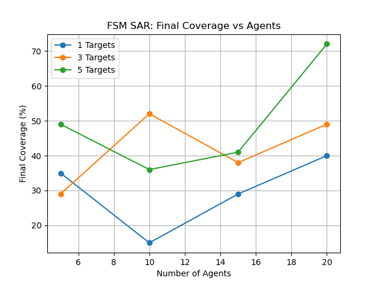

# ENAE788O - Final Project

## Bio-Inspired Swarm Flocking with Minimal Communication for Adaptive Search Operations

### Venkata Madhav Tadavarthi (121058768)

## Introduction:

This project aims to develop and simulate an autonomous surface swarm system with bio-inspired flocking for search tasks, with adaptive formation control in a simulated ocean environment using a decentralized control system to enable minimal communication while maintaining coordination.

## Code Base:

This repository currently consists of four main codes:

### csa.py

This script is an implementation of the standard CSA Flocking Algorithm.

### modified_csa.py

This script is an implementation of the Modified CSA Flocking Algorithm by introducing the Information Bias.

### sar_modified_csa.py

This script is an implementation of the Search and Rescue Mission (SAR) on top of using the Modified CSA Flocking Algorithm by introducing the Information Bias.

### fsm.py

This script introduces FSM to the Search and Rescue Mission (SAR) on top of using the Modified CSA Flocking Algorithm.

### Evaluations/

This folder contains the copy of the FSM script, which is used to evaluate the approach with vairous swarm sizes and different number of targets. Here are the sample plots from the evalautions:

## Report:

You can find the full project report at: [this link](ENAE788O_Final_Project.pdf).

^ All references are mentioned in the repository.